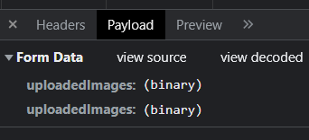

# drc_task_nodejs

# multiple image upload
Code for uploading multiple images:  <b>demo_image/index.html</b>
post method 
http://localhost:5000/product/add-image/:id 
 

# env
JWT_KEY=XXXXXXXXX  
please add <b>JWT_KEY</b> in .env file

# user table
name  
mobile 
password 
role => admin, user 
createAt 
updatedAt 

 
 
 

# product table
id  
name 
size 
color 
price 
quantity 

# order table
id 
user_id 
product_id 
order_code 
order_date 
require_date 
shipped_date 
order_status => pending, cancle, shipped, complated 

 
 
 

# images
id  
product_id 
image 